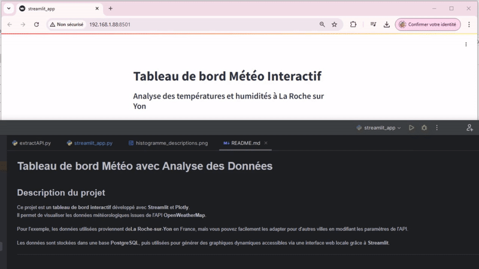
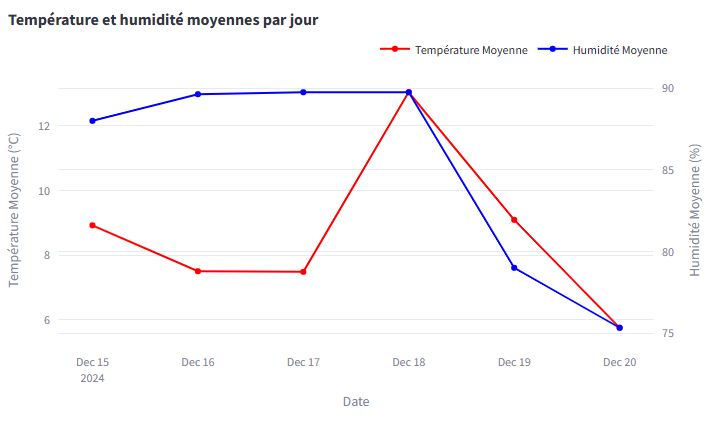
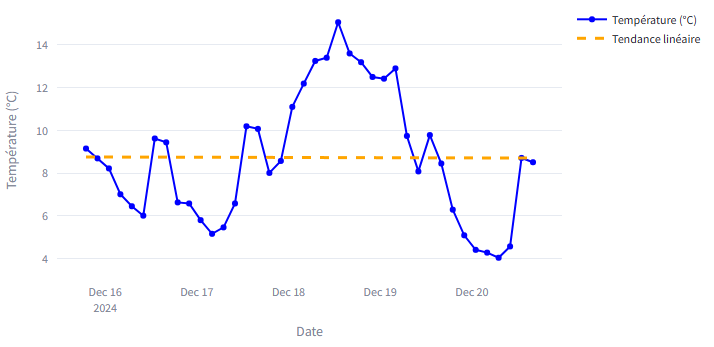
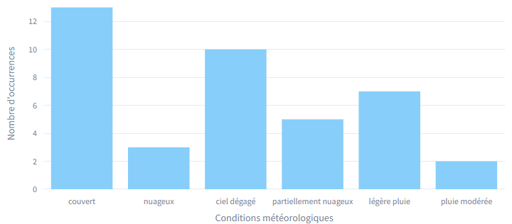

# 🌦️ **Tableau de bord Météo avec Analyse des Données**

## 📚 **Description du projet**  
Ce projet est un **tableau de bord interactif** développé avec **Streamlit** et **Plotly**.  
Il permet de visualiser les données météorologiques issues de l'API **OpenWeatherMap**.  

Pour l'exemple, les données utilisées proviennent de **La Roche-sur-Yon** en France, mais vous pouvez facilement les adapter pour d'autres villes en modifiant les paramètres de l'API.

Les données sont stockées dans une base **PostgreSQL**, puis utilisées pour générer des graphiques dynamiques accessibles via une interface web locale grâce à **Streamlit**.

---
## **🎥 Démonstration Vidéo**  

Découvrez le projet en action dans cette courte démonstration :  

[](media/demo_meteo_project.mp4)  

> 📹 **Cliquez sur le GIF pour voir la vidéo complète.**

---


## ⚙️ **Fonctionnalités**

**✅ Visualisation des moyennes journalières** :  
   - Température et humidité moyennes par jour.  

**✅ Graphique des températures horaires** :  
   - Affichage avec une **tendance linéaire** calculée automatiquement.  

**✅ Histogramme des descriptions météo** :  
   - Répartition des conditions météorologiques (pluie, nuageux, etc.).  

**✅ Filtrage interactif** :  
   - Sélectionner une période pour afficher les données horaires correspondantes.  

**✅ Export des données** :  
   - Télécharger les données filtrées en **CSV** directement depuis l'interface.

---

## **🛠️ Technologies utilisées**

- **Python** : Langage principal.  
- **Streamlit** : Interface utilisateur interactive.  
- **Plotly** : Visualisation avancée des graphiques.  
- **PostgreSQL** : Stockage des données météorologiques.  
- **SQLAlchemy** : Connexion à la base de données.  
- **Pandas** : Manipulation et analyse des données.  
- **API OpenWeatherMap** : Source des données météorologiques.

---

## 📦 **Prérequis**

Pour exécuter ce projet, vous devez installer :  

### **Python 3.8+**  

### **Bibliothèques Python**  
Copier-coller la commande suivante pour installer les dépendances :  
```
pip install streamlit plotly pandas numpy sqlalchemy psycopg2 requests
```
### **Installation des dépendances**  
Utilisez la commande suivante pour installer toutes les bibliothèques nécessaires :  
```
pip install -r requirements.txt
```

---
## 🚀 Installation et exécution
### 1. Cloner le dépôt GitHub :
```
git clone https://github.com/ton_nom_dutilisateur/nom_du_repo.git
cd nom_du_repo
```
### 2. Configuration de la base de données PostgreSQL
Exécutez le script SQL suivant pour créer les tables nécessaires :
```
CREATE SCHEMA IF NOT EXISTS meteo;

CREATE TABLE IF NOT EXISTS meteo.donnees_brutes (
    id SERIAL PRIMARY KEY,
    date_heure TIMESTAMP,
    temperature FLOAT,
    humidite INT,
    description VARCHAR(255)
);
```
### 3. Configuration de l'API
Ajoutez votre clé API OpenWeatherMap dans un fichier .env (exemple : .env dans le répertoire racine) :

```
API_KEY=Votre_cle_API_OpenWeatherMap
```
---
### 4. Lancer le tableau de bord
```
streamlit run streamlit_app.py
```
---

### 5. Changer de localisation
Dans le fichier `extractAPI.py`, remplacez la valeur de `VILLE` :  
```python
VILLE = 'Paris,FR'  # Exemple : pour récupérer les données de Paris
```
---

## 📁 **Structure du projet**
```
nom_du_repo/
│-- extractAPI.py          # Script pour récupérer et insérer les données
│-- streamlit_app.py       # Tableau de bord interactif
│-- README.md              # Documentation du projet
│-- requirements.txt       # Liste des dépendances
│-- .env                   # Clé API OpenWeatherMap + infos PostgreSQL
│-- media/                 # Vidéos et GIFs de démonstration
│   ├── demo_meteo_project.mp4
│   ├── demo_meteo_project.gif
│-- images/                # Captures d'écran du projet
```
---
### 🖥️ **Aperçu du projet**  
Voici quelques captures d'écran du tableau de bord interactif :

**📊 Moyennes journalières de température et d'humidité**  
- Visualisez la température et l'humidité moyennes pour chaque journée.
- Identifiez rapidement les tendances globales sur plusieurs jours.

  

📈 **Évolution des températures avec tendance linéaire**  
- Observez les fluctuations horaires des températures.  
- La tendance linéaire permet de mieux comprendre l'évolution générale sur la période sélectionnée. 
 
  

📊 **Histogramme des descriptions météo**  
- Analysez la répartition des conditions météorologiques (pluie, nuages, ciel dégagé, etc.).  
- Identifiez les phénomènes météorologiques les plus fréquents sur la période sélectionnée.  
  
  

---
## 👤 **Auteur**
- Rémi Beaurain 

📧 [remi.beaurain@gmail.com](mailto:remi.beaurain@gmail.com)
• 💼 [Mon LinkedIn]( https://www.linkedin.com/in/r%C3%A9mi-beaurain-165ba639/ )  


---
## 📝 **Licence**  
Ce projet est sous licence **MIT**. Vous pouvez l'utiliser librement, le modifier et le partager.  

---
## ⭐ **Contribuer au projet**
N'hésitez pas à ouvrir une issue ou soumettre une pull request si vous avez des améliorations à proposer.
